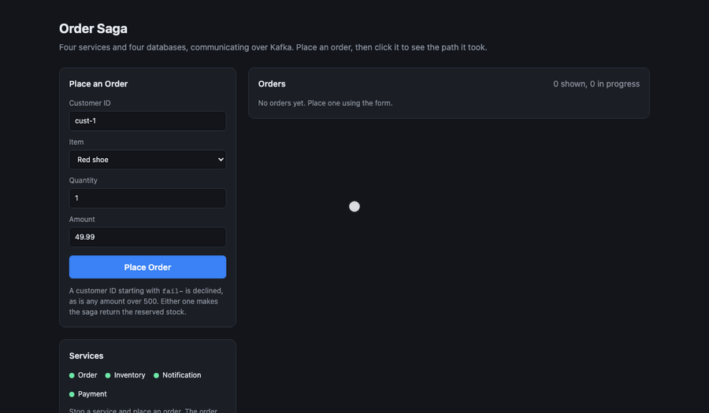
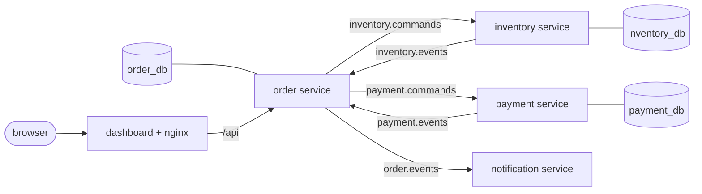
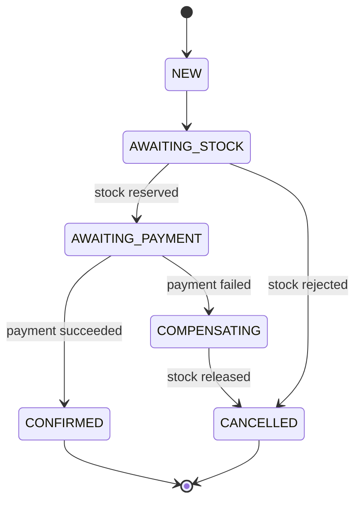

# sagaflow

[](https://github.com/ashishhkumarr/sagaflow/actions/workflows/build.yml)

An order system split into four Spring Boot services that talk to each other over Kafka.
Placing an order reserves stock, charges a fake card and sends a notification, and if a
step fails, the steps before it get undone.

The ordering part is simple on purpose. The point of the project is everything around it:
services crashing halfway through, Kafka going down, the same message arriving twice, a
reply showing up late. None of that should lose an order, sell stock twice or charge a card
twice.

**Live demo:** https://sagaflow.tech (orders and stock reset every night)



## how it fits together



Every arrow with a topic name on it goes through Kafka.

The order service is in charge. It keeps track of where each order is in its own database,
sends commands to inventory and payment, and they answer with events. Inventory and payment
do not know about each other, and notification only listens for orders finishing. Each
service has its own Postgres database and none of them reads another one's tables.

Java 21, Spring Boot 4.1, Kafka 4.0 (KRaft, no ZooKeeper), Postgres 16 with Flyway, a React
and TypeScript dashboard, and Testcontainers for the tests.

## what happens to an order

1. `POST /orders` saves the order and sends `reserve-stock` to inventory
2. inventory takes the stock if there is enough and answers `stock-reserved` or `stock-rejected`
3. the order service sends `process-payment` to payment
4. payment answers `payment-succeeded` or `payment-failed`
5. on success the order is CONFIRMED and `commit-stock` tells inventory the stock is sold
6. on failure the order service sends `release-stock`, waits for `stock-released`, and only
   then marks the order CANCELLED
7. notification writes the email it would have sent



The allowed moves live in one table on the `OrderStatus` enum, and anything not in it gets
refused. That is what turns away a duplicate reply or one that arrives after the order has
moved on. There is no arrow from AWAITING_PAYMENT straight to CANCELLED, so once stock is
held, the only way to cancel is through COMPENSATING, which gives the stock back first.

## the parts that were actually hard

### saving to the database and sending to Kafka together

Those two cannot happen in one transaction. At first, with Kafka down, `POST /orders` hung
for a minute and then failed, and a crash between the database commit and the send could
lose the message for good. Now each service writes the message to an `outbox` table in the
same transaction as the change, and a poller sends unsent rows
(`for update skip locked`, so two copies of a service never send the same row). With Kafka
down, orders are still accepted straight away and go out once it is back.

### getting the same message twice

Kafka delivers at least once, so every consumer has to cope with repeats. Inventory and
payment record each message id they have handled in `processed_messages`. A repeated command
gets the original answer sent again instead of being ignored, because the first answer might
be the thing that got lost. On top of that, inventory checks by order id and the `payments`
table is keyed on order id, since a retried command has a fresh message id but is still the
same order.

### orders that get stuck

If an order has been waiting on a reply for more than 30 seconds, the order service sends the
command again, which is only safe because of the duplicate handling above. Stock that has
been held for more than 5 minutes by an order that never finished is given back. Stock for a
confirmed order is marked as sold, so that sweep leaves it alone.

### messages that cannot be handled

A listener that throws gets a few more tries with a growing gap between them, so a short
database outage does not cost the message. If it still fails, or the message is malformed
and will never parse, it goes to `<topic>.dlt` with the exception and stack trace in the
headers instead of being dropped or blocking the partition.

```
docker exec kafka /opt/kafka/bin/kafka-console-consumer.sh \
  --bootstrap-server localhost:19092 --topic inventory.commands.dlt \
  --from-beginning --property print.headers=true
```

### following one order through four services

Every request gets a correlation id, which travels in a Kafka header and shows up in every
log line it touches, in all four services. Searching the logs for one id shows the whole
story of one order. The dashboard shows the same thing: click an order to see each step it
went through and how long each one took.

### a fresh Kafka stalling orders for five minutes

This one only showed up when deploying to a clean server. A service would subscribe to a
topic that did not exist yet, so Kafka created it with one partition. When the owning service
raised it to three, the consumer took five minutes to notice the new partitions, and orders
that landed on them just sat there. A one-off `kafka-init` container now creates the topics
before any service starts, in both compose files.

## running it locally

Needs Docker and Java 21.

```
docker compose up -d
```

That brings up Kafka on 9092 and one Postgres per service (5432 order, 5433 inventory,
5434 payment). Then build and start the four services:

```
./mvnw clean package
java -jar order-service/target/order-service-0.0.1-SNAPSHOT.jar
java -jar inventory-service/target/inventory-service-0.0.1-SNAPSHOT.jar
java -jar payment-service/target/payment-service-0.0.1-SNAPSHOT.jar
java -jar notification-service/target/notification-service-0.0.1-SNAPSHOT.jar
```

They run on 8081 to 8084. `scripts/services.sh` can start and stop them for you, with logs
going to `logs/`.

The dashboard runs on 5173:

```
cd dashboard
npm install
npm run dev
```

Or place an order with curl:

```
curl -X POST http://localhost:8081/orders \
  -H 'Content-Type: application/json' \
  -d '{"customerId":"cust-42","item":"red shoe","quantity":1,"amount":49.99}'
```

Stock starts at red shoe 10, green hat 5, blue shirt 3, black jacket 1, so ordering more
than that gets rejected. Payments over 500 get declined, and so does any customer id
starting with `fail-`, which is handy for trying the unhappy paths.

## tests

```
./mvnw test
```

Each service starts its own Postgres and Kafka in containers, so the tests do not care what
is running on the machine, but Docker has to be running. They also run on GitHub Actions on
every push.

What they cover, mostly things that actually went wrong while building this:

- an order going all the way to confirmed, and a failed payment putting the stock back
  before the order is cancelled
- a reply for a step the order is already past being ignored
- the same command arriving twice only moving stock once, and only charging once
- a resent command with a fresh id still not taking stock twice
- releasing twice not inventing stock that never existed

## breaking it on purpose

`scripts/chaos.sh` runs through the failures that came up while building this, one at a
time, each from a clean reset:

- inventory stopped while orders come in
- payment stopped after stock is already reserved
- the order service killed straight after taking orders
- Kafka stopped while orders are placed
- the inventory database dropping out for a few seconds
- thirty orders at once while payment restarts

Every scenario places a mix of orders that should go through, get declined, go over the
limit or run out of stock, waits until nothing is in flight, then runs
`scripts/reconcile.sh`. That checks no order is stuck halfway and that stock on the shelf,
held and sold still adds up to what it started with.

```
./mvnw package -DskipTests
docker compose up -d
./scripts/chaos.sh                 # everything
./scripts/chaos.sh broker_down     # just one
```

`scripts/reset.sh` wipes the orders and puts the stock back.

## running it on a server

`docker-compose.prod.yml` puts the whole thing on one machine: Kafka, the three databases,
the four services, the dashboard behind nginx, and Caddy in front of all of it. Only Caddy
is published, on 80 and 443. It gets the HTTPS certificate from Let's Encrypt the first time
the domain is visited and renews it on its own, so there is nothing to remember. nginx passes
`/api` on to the order service. Kafka, the databases and the services cannot be reached from
outside.

```
cp .env.example .env          # a real POSTGRES_PASSWORD, and the domain in SITE_DOMAIN
docker compose -f docker-compose.prod.yml up -d --build
```

The domain has to point at the server before the first start, otherwise Caddy cannot prove
it owns it and the certificate request fails.

The first build takes a few minutes because Maven and every dependency get downloaded inside
the image.

Everything together uses about 2 GB of memory when idle, so a server with 4 GB is a
comfortable size. A 1 GB machine will not fit four JVMs and Kafka. The live demo runs on an
Oracle Cloud free tier Arm machine with 2 cores and 6 GB.

The link is public, so nginx limits how fast one address can call `/api`, and placing
orders has a tighter limit of its own. Past that it answers 429 and the form says to try
again in a minute.

There is not much stock, so a few visitors would sell everything out. A cron job on the
server runs `scripts/reset.sh` every night to clear the orders and put the stock back:

```
30 18 * * * cd /home/opc/sagaflow && ORDER_DB=sagaflow-order-db-1 INVENTORY_DB=sagaflow-inventory-db-1 PAYMENT_DB=sagaflow-payment-db-1 ./scripts/reset.sh >> /home/opc/reset.log 2>&1
```

18:30 UTC is midnight in India, where the server is.

## known limits

- No login. Anyone with the link can place orders, and the nginx rate limit is the only
  protection.
- One Kafka broker on one machine, with every topic at replication factor 1. If the server
  goes down, so does everything.
- Sent outbox rows and `processed_messages` are never cleaned up. Fine for a demo that resets
  every night, but a real system would delete old rows on a schedule.
- When inventory answers a repeated command it works the reason out again, so a replay can
  word a rejection differently from the first answer. The stock numbers are never wrong.
- The dashboard asks for updates every second instead of using websockets. Simpler, and
  every refresh comes straight from the database.

## project layout

- `contracts` the commands, events and topic names every service shares
- `common` correlation ids and the Kafka error handling
- `outbox` and `inbox` the outbox poller and the processed message check
- `order-service` (8081), `inventory-service` (8082), `payment-service` (8083),
  `notification-service` (8084)
- `dashboard` the React app
- `scripts` start, reset, reconcile and chaos scripts

MIT licensed.
